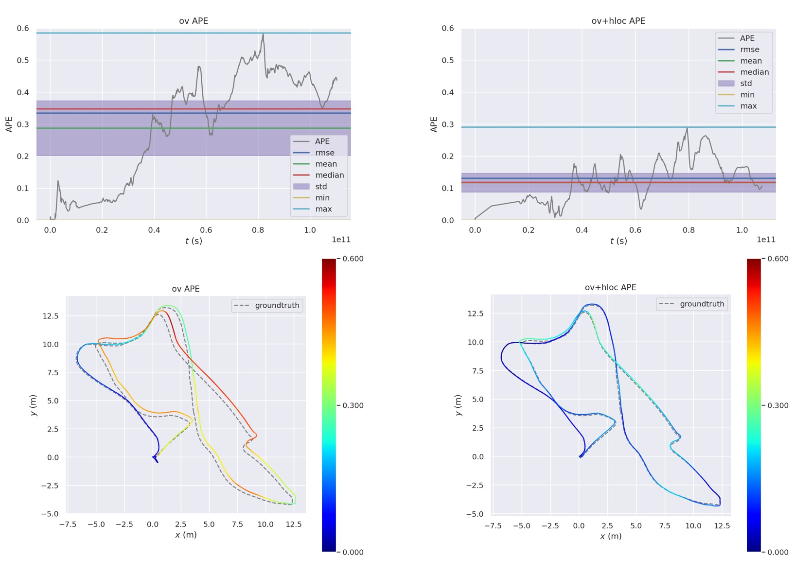

# OV_HLOC

Using **[Hierarchical-Localization](https://github.com/cvg/Hierarchical-Localization)** instead of DBoW2 for loop closure. This was originally part of my undergraduate final project, where I worked on improving the loop closure module of VINS-Fusion. I found it just right for providing a loosely coupled pose graph for **[OpenVINS](https://github.com/rpng/open_vins)**.

Thanks to the excellent global pose graph optimization provided by VINS-Fusion, this project performs well on the EuRoC dataset.



In the application scenario you can use COLMAP to build SfM maps (using SuperPoint and NetVLAD). The use of a priori maps can give you more accurate positioning results and no accumulative errors.

## Dependencies

* OpenVINS - <https://docs.openvins.com/gs-installing.html>

* Ceres Solver - <https://github.com/ceres-solver/ceres-solver>

* PyTorch and libtorch - <https://pytorch.org/get-started/locally/>

  For libtorch, all you need to do is unzip it and fill the file path into [loop_hloc/CMakeLists.txt](loop_hloc/CMakeLists.txt) line 22.

  ```cmake
  # set your own libtorch path
  set(TORCH_PATH */libtorch/share/cmake/Torch)
  ```

## Installation Commands

```shell
# setup our workspace
mkdir -p ~/workspace/catkin_ws_ov/src/
cd ~/workspace/catkin_ws_ov/src/
# repositories to clone
cd src
git clone https://github.com/rpng/open_vins.git
git clone https://github.com/Li-Jesse-Jiaze/ov_hloc.git
# go back to root and build
cd ..
catkin build -j4
```

## Download and Convert HF-Net

Download [SuperGluePretrainedNetwork/models/weights](https://github.com/magicleap/SuperGluePretrainedNetwork/tree/master/models/weights) and place them in `support_files/Networks/weights`.

```shell
cd ~/workspace/catkin_ws_ov/src/ov_hloc/support_files/
python convert_model.py
```

## Run Example

``` shell
roslaunch ov_msckf subscribe.launch config:=euroc_mav # term 1
rosrun loop_hloc loop_hloc_node ~/workspace/catkin_ws_ov/src/ov_secondary/config/master_config.yaml # term 2
rviz # term 3
rosbag play V1_01_easy.bag # term 4
```

select `config/vins_rviz_config.rviz` as config in rviz

The pose graph is not very smooth when I tested it on my laptop(RTX 2060 Max-Q 65W). This is mainly because my NetVLAD is using a VGG16 (it tooks more than 50ms for each frame 😠). It would be better to use a lighter network (e.g. Mobile Net) and fine-tuning it for your application scenario to describe the images for NetVLAD.

Here's a simple [video](https://www.bilibili.com/video/bv1KP4y1F73M) of it working with VINS-Fusion.
