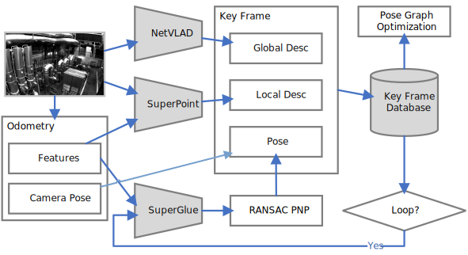

# OV_HLOC

Using **[Hierarchical-Localization](https://github.com/cvg/Hierarchical-Localization)** instead of DBoW2 for loop closure. This was originally part of my undergraduate final project, where I worked on improving the loop closure module of VINS-Fusion. I found it just right for providing a loosely coupled pose graph for **[OpenVINS](https://github.com/rpng/open_vins)**.



Thanks to the excellent global pose graph optimization provided by VINS-Fusion, this project performs well on the EuRoC dataset.


In the application scenario you can use COLMAP to build SfM maps (using SuperPoint and NetVLAD). The use of a priori maps can give you more accurate positioning results and no accumulative errors.

## Dependencies

* Ubuntu and ROS - [noetic/Installation/Ubuntu - ROS Wiki](http://wiki.ros.org/noetic/Installation/Ubuntu)
  This will help you to install a series of dependencies such as OpenCV.

* OpenVINS - <https://docs.openvins.com/gs-installing.html>

* PyTorch and libtorch - <https://pytorch.org/get-started/locally/>

  For libtorch, all you need to do is unzip it and fill the file path into [loop_hloc/CMakeLists.txt](loop_hloc/CMakeLists.txt) line 22.

  ```cmake
  # set your own libtorch path
  set(TORCH_PATH */libtorch/share/cmake/Torch)
  ```

I recommend installing them in the following order.

<details>
<summary>[CUDA and cuDNN]</summary>

**CUDA**:

```bash
# You need to adjust it according to your system version
export DISTRO=ubuntu2004
export APT_INSTALL=cuda-toolkit-11-6

# add CUDA into apt-key
sudo apt-key adv --fetch-keys http://developer.download.nvidia.com/compute/cuda/repos/${DISTRO}/x86_64/7fa2af80.pub
echo "deb http://developer.download.nvidia.com/compute/cuda/repos/${DISTRO}/x86_64 /" | sudo tee /etc/apt/sources.list.d/cuda.list
wget https://developer.download.nvidia.com/compute/cuda/repos/${DISTRO}/x86_64/cuda-${DISTRO}.pin
sudo mv cuda-${DISTRO}.pin /etc/apt/preferences.d/cuda-repository-pin-600

# Install CUDA Toolkit
sudo apt update && sudo apt -y upgrade
sudo apt install -y ${APT_INSTALL}

# Set environment variables
cat << 'EOS' >> ~/.profile
export PATH=/usr/local/cuda-11.6/bin${PATH:+:${PATH}}

# Install third-party libraries (optional)
sudo apt install -y g++ freeglut3-dev build-essential libx11-dev libxmu-dev libxi-dev libglu1-mesa libglu1-mesa-dev
```

**cuDNN**:

In order to download cuDNN libraries, you need to go to https://developer.nvidia.com/cudnn and click on the **Download cuDNN** button. The webpage will ask you to login into the NVIDIA developer account. After logging in and accepting their terms and conditions, you should click on the following three links:

[cuDNN Runtime Library for Ubuntu20.04 x86_64 (Deb)](https://developer.nvidia.com/compute/machine-learning/cudnn/secure/8.2.0.53/11.3_04222021/Ubuntu20_04-x64/libcudnn8_8.2.0.53-1+cuda11.3_amd64.deb)

[cuDNN Developer Library for Ubuntu20.04 x86_64 (Deb)](https://developer.nvidia.com/compute/machine-learning/cudnn/secure/8.2.0.53/11.3_04222021/Ubuntu20_04-x64/libcudnn8-dev_8.2.0.53-1+cuda11.3_amd64.deb)

[cuDNN Code Samples and User Guide for Ubuntu20.04 x86_64 (Deb)](https://developer.nvidia.com/compute/machine-learning/cudnn/secure/8.2.0.53/11.3_04222021/Ubuntu20_04-x64/libcudnn8-samples_8.2.0.53-1+cuda11.3_amd64.deb)

which is relevant to Ubuntu 20.04 LTS. After downloading, you should have the following three .deb files:

1. libcudnn8-samples_8.2.0.53–1+cuda11.3_amd64.deb
2. libcudnn8-dev_8.2.0.53–1+cuda11.3_amd64.deb
3. libcudnn8_8.2.0.53–1+cuda11.3_amd64.deb

that you can install using `dpkg` commands:

``` bash
sudo dpkg -i  libcudnn8_8.2.0.53-1+cuda11.3_amd64.deb
sudo dpkg -i libcudnn8-dev_8.2.0.53-1+cuda11.3_amd64.deb
sudo dpkg -i libcudnn8-samples_8.2.0.53-1+cuda11.3_amd64.deb
```

After the installation is complete you can verify the installation with https://github.com/nvidia/cuda-samples.

</details>

<details>
<summary>[Pytorch and libtorch]</summary>

**Pytorch**: Follow [Start Locally | PyTorch](https://pytorch.org/get-started/locally/) to install Pytorch. Here I recommend using conda to install pytorch.

```bash
conda install pytorch torchvision torchaudio cudatoolkit=11.6 -c pytorch -c conda-forge
```

*Note: The cudatoolkit version here does not have to be the same as before.*

**libtorch**: Follow [Start Locally | PyTorch](https://pytorch.org/get-started/locally/) to install libtorch. Select `Stable (1.12.1)` `Linux` `LibTorch` `C++ / Java` `CUDA 11.6`. Download and extract the zip file corresponding to the (cxx11 ABI) link, you will get a folder named `libtorch`.

</details>

<details>
<summary>[ROS]</summary>

**ROS**: Follow [Getting Started » Installation Guide | OpenVINS](https://docs.openvins.com/gs-installing.html#gs-install-openvins) to install ROS1.

```bash
sudo sh -c 'echo "deb http://packages.ros.org/ros/ubuntu $(lsb_release -sc) main" > /etc/apt/sources.list.d/ros-latest.list'
sudo apt-key adv --keyserver 'hkp://keyserver.ubuntu.com:80' --recv-key C1CF6E31E6BADE8868B172B4F42ED6FBAB17C654
sudo apt-get update
export ROS1_DISTRO=noetic # kinetic=16.04, melodic=18.04, noetic=20.04
sudo apt-get install ros-$ROS1_DISTRO-desktop-full
sudo apt-get install python-catkin-tools # ubuntu 16.04, 18.04
sudo apt-get install python3-catkin-tools python3-osrf-pycommon # ubuntu 20.04
sudo apt-get install libeigen3-dev libboost-all-dev libceres-dev

# for bash user
echo "source /opt/ros/$ROS1_DISTRO/setup.bash" >> ~/.bashrc
source ~/.bashrc

# for zsh user
# echo "source /opt/ros/$ROS1_DISTRO/setup.zsh" >> ~/.zshrc
# source ~/.zshrc
```

</details>


<details>
<summary>[OpenVINS]</summary>

**OpenVINS**: Follow [Getting Started » Installation Guide | OpenVINS](https://docs.openvins.com/gs-installing.html#gs-install-openvins) to clone the OpenVINS project.

```bash
mkdir -p ~/workspace/catkin_ws_ov/src/
cd ~/workspace/catkin_ws_ov/src/
git clone https://github.com/rpng/open_vins/
```

</details>

<details>
<summary>[ov_hloc]</summary>

**ov_hloc**: Congratulations on all the hard work you've gone through to get here.

```bash
mkdir -p ~/workspace/catkin_ws_ov/src/
cd ~/workspace/catkin_ws_ov/src/
git clone https://github.com/Li-Jesse-Jiaze/ov_hloc.git
```

Fill the `libtorch` folder path into [loop_hloc/CMakeLists.txt](https://github.com/Li-Jesse-Jiaze/ov_hloc/blob/master/loop_hloc/CMakeLists.txt) line 22.

```
# set your own libtorch path
set(TORCH_PATH */libtorch/share/cmake/Torch)
```

</details>


<details>
<summary>[build and run]</summary>

**build**:

```bash
cd ~/workspace/catkin_ws_ov
catkin build
source ~/workspace/catkin_ws_ov/devel/setup.bash # for bash user
# source ~/workspace/catkin_ws_ov/devel/setup.zsh # for zsh user
```

</details>

## Download and Convert HF-Net

Download [SuperGluePretrainedNetwork/models/weights](https://github.com/magicleap/SuperGluePretrainedNetwork/tree/master/models/weights) and place them in `support_files/Networks/weights`.

```shell
cd ~/workspace/catkin_ws_ov/src/ov_hloc/support_files/
python convert_model.py
```

## Run Example

``` shell
roslaunch ov_msckf subscribe.launch config:=euroc_mav # term 1
rosrun loop_hloc loop_hloc_node ~/workspace/catkin_ws_ov/src/ov_secondary/config/master_config.yaml # term 2
rviz # term 3
rosbag play your/dataset/path/V1_01_easy.bag # term 4
```

select `config/vins_rviz_config.rviz` as config in rviz

The pose graph was not very smooth when I tested it on my laptop(RTX 2060 Max-Q 65W). This is mainly because my NetVLAD is using a VGG16 (it tooks more than 50ms for each frame 😠). It would be better to use a lighter backbone (e.g. MobileNetV3) and fine-tuning NetVLAD for your application scenario.

Here's a simple [video](https://www.bilibili.com/video/bv1KP4y1F73M) of it working with VINS-Fusion.
